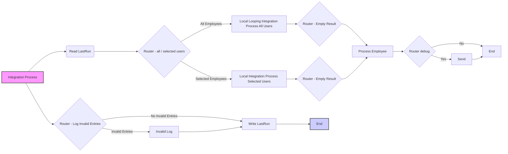

```markdown
# Integration Flow Technical Specification

This document provides a detailed technical specification for the SAP Cloud Integration flow, outlining all processes, steps, and configurations. It serves as a guide for understanding the flow's logic and its components.

## Process Overview

The integration flow is designed to synchronize user data from SuccessFactors (SF) to an external system, potentially Azure AD. It handles both full and delta loads, logging errors and providing notifications. The following diagram illustrates the main processes involved:



## Integration Flow Initiation

The integration flow is initiated via a timer-based start event called **Start Timer**. This means the flow will execute based on a pre-defined schedule, configured within the SAP Cloud Integration platform. There is no other way to start this integration flow.

## Detailed Process Description

### 1. Integration Process

This is the main process of the integration flow. It orchestrates the entire data synchronization process.

#### Start Timer
-   **Type**: `StartEvent`
-   **Description**: This step initiates the integration flow based on a scheduled timer.
-   **Outgoing**: `Read LastRun`

#### Read LastRun
- **Type**: `CallLocalProcess`
- **Description**: This step calls the 'Read LastRun' sub-process, responsible for retrieving the timestamp of the last successful run.
- **Outgoing**: `Configure Flow`

#### Configure Flow

-   **Type**: `ContentModifier`
-   **Description**: This step sets several properties that control the behavior of the flow. These properties are used later in the process.
-   **Outgoing**: `Router - all / selected users`

-   **Property Table:**
    | Name                    | Action  | Type     | Value                                | Data Type        |
    | :---------------------- | :------ | :------- | :----------------------------------- | :--------------- |
    | `RolesToExclude`        | Create  | constant | `{{Roles_To_Exclude}}`              |                  |
    | `queryusernames`        | Create  | constant | `{{SF_Query_usernames}}`            |                  |
    | `processDirectUrl`      | Create  | constant | `{{ProcessDirect_Url}}`             |                  |
    | `debuggingEnabled`      | Create  | constant | `{{Debugging_Enabled}}`             |                  |
    | `emailFrom`             | Create  | constant | `{{Email_From}}`                    |                  |
    | `EmailNotificationsEnabled` | Create  | constant | `{{Email_Notifications_Enabled}}`    |                  |
    | `SFTPLoggingEnabled`   | Create  | constant | `{{SFTP_Logging_Enabled}}`          |                  |
    | `emailRecipients`      | Create  | constant | `{{Email_Recipients}}`              |                  |
    | `processAllEmployees`      | Create  | constant | `{{All_Employees}}`                |                 |

#### Router - all / selected users

-   **Type**: `router`
-   **Description**: This step routes the flow based on the value of the `processAllEmployees` property.
-   **Outgoing (Selected Employees)**: `Process Call - Selected Users` if property `processAllEmployees` does not equal 'true'
-   **Outgoing (All Employees)**: `Looping Process Call - All Users` if the property `processAllEmployees` is set to 'true'

#### Looping Process Call - All Users

-   **Type**: `CallLocalProcess`
-  **Description**: Calls the 'Local Looping Integration Process All Users' sub-process to process all users.
-   **Outgoing**: `Router - Log Invalid Entries`

#### Process Call - Selected Users

-   **Type**: `CallLocalProcess`
-   **Description**: Calls the 'Local Integration Process Selected Users' sub-process to process a subset of users.
-   **Outgoing**: `Router - Log Invalid Entries`

#### Router - Log Invalid Entries

-   **Type**: `router`
-   **Description**: Routes the flow based on whether there are any errors encountered during the user processing. It evaluates the number of errors present in the XML structure of the message.
-   **Outgoing (Invalid Entries)**: `Invalid Log` if the count of `/root/error` nodes is greater than 0.
-  **Outgoing (No Invalid Entries)**: `Write LastRun` if there are no invalid entries

#### Invalid Log
-   **Type**: `CallLocalProcess`
-   **Description**: Calls the 'Invalid Log' sub-process to handle logging of invalid user entries.
-   **Outgoing**: `Write LastRun`

#### Write LastRun
-  **Type**: `CallLocalProcess`
- **Description**: This step calls the 'Write LastRun' sub-process, responsible for storing the timestamp of the current run.
- **Outgoing**: `End`

#### End
-   **Type**: `endEvent`
-   **Description**: Marks the end of the integration flow process.

### 2. Local Integration Process Selected Users

This process handles the retrieval and processing of a selected subset of users.

#### Start
-   **Type**: `StartEvent`
-   **Description**: Start event for the sub-process.
-   **Outgoing**: `Request Reply - SF`

#### Request Reply - SF
-   **Type**: `API_CALL`
-   **Description**: This step calls the SuccessFactors API to retrieve selected user data. It utilizes the `SuccessFactorsODataSingleUser` adapter, which calls the SF system.
-   **Receiver**: `SF`
-   **Outgoing**: `Router - Empty Result`

#### Router - Empty Result
-   **Type**: `router`
-   **Description**: This step routes based on whether any user data was returned from SF.
-   **Outgoing (Empty result)**: `End` if no user is present in the incoming payload. It evaluates the existence of `//User/User/node()` in the incoming XML.
-   **Outgoing (Valid result)**: `Process Call - Process Employees` if the result contains a user entry.

#### Process Call - Process Employees
-   **Type**: `CallLocalProcess`
-  **Description**: Calls the 'Process Employee' sub-process, which handles the processing of individual users.
-  **Outgoing**: `Filter`

#### Filter
- **Type**: `None`
- **Description**: Filters out the unnecessary data from the payload. This step is used as a placeholder for a filter step that has been removed.
- **Outgoing**: `Save Body`

#### Save Body
-  **Type**: `ContentModifier`
- **Description**: This step saves the current body to a property. It stores all the information in a property called `savedBody` so that the body can be re-used later.
- **Outgoing**: `Set Body`

-   **Property Table:**
    | Name          | Action  | Type       | Value                  | Data Type       |
    | :------------ | :------ | :--------- | :--------------------- | :-------------- |
    | `savedBody`   | Create  | expression | `${property.savedBody}${body}` | `java.lang.String`|
   
#### Set Body
- **Type**: `None`
- **Description**: Sets the body to the current body (no change is made). This step is used as a placeholder for a set body step that has been removed.
- **Outgoing**: `End`
#### End
-   **Type**: `endEvent`
-   **Description**: Marks the end of the sub-process.

### 3. Local Looping Integration Process All Users

This process handles the retrieval and processing of all users from SuccessFactors.

#### Start
-   **Type**: `StartEvent`
-   **Description**: Start event for the sub-process.
-   **Outgoing**: `Request Reply - SF All users`

#### Request Reply - SF All users
-   **Type**: `API_CALL`
-   **Description**: This step calls the SuccessFactors API to retrieve all user data. It utilizes the `SuccessFactorsODataAllUsers` adapter, which calls the SF system.
-   **Receiver**: `SF`
-   **Outgoing**: `Router - Empty Result`

#### Router - Empty Result
-   **Type**: `router`
-   **Description**: This step routes based on whether any user data was returned from SF.
-   **Outgoing (Empty result)**: `End` if no user is present in the incoming payload. It evaluates the existence of `//User/User/node()` in the incoming XML.
-   **Outgoing (Valid result)**: `Process Call - Process Employees` if the result contains a user entry.

#### Process Call - Process Employees
-   **Type**: `CallLocalProcess`
-   **Description**: Calls the 'Process Employee' sub-process, which handles the processing of individual users.
-   **Outgoing**: `Filter`

#### Filter
- **Type**: `None`
- **Description**: Filters out the unnecessary data from the payload. This step is used as a placeholder for a filter step that has been removed.
- **Outgoing**: `Save Body`

#### Save Body
-  **Type**: `ContentModifier`
- **Description**: This step saves the current body to a property. It stores all the information in a property called `savedBody` so that the body can be re-used later.
- **Outgoing**: `Set Body`

-   **Property Table:**
    | Name          | Action  | Type       | Value                  | Data Type       |
    | :------------ | :------ | :--------- | :--------------------- | :-------------- |
    | `savedBody`   | Create  | expression | `${property.savedBody}${body}` | `java.lang.String`|

#### Set Body
- **Type**: `None`
- **Description**: Sets the body to the current body (no change is made). This step is used as a placeholder for a set body step that has been removed.
- **Outgoing**: `End`

#### End
-   **Type**: `endEvent`
-   **Description**: Marks the end of the sub-process.

### 4. Process Employee

This process handles the logic of mapping and enriching user information, also it calls an external system.

#### Start
-   **Type**: `StartEvent`
-   **Description**: Start event for the sub-process.
-   **Outgoing**: `Message Mapping - filter dates`

#### Message Mapping - filter dates
-   **Type**: `MessageMapping`
-   **Description**: This step filters out certain date fields from the incoming payload using the message mapping `MM_SFSF_Filter_Nodes_Dates`.
-   **Outgoing**: `XSLT Mapping - exclude filter_roles`

#### XSLT Mapping - exclude filter_roles
-   **Type**: `XSLTMapping`
-   **Description**: This step filters out roles based on a filter from the `RolesToExclude` property using the xslt mapping `excludefilter_roles`.
-   **Outgoing**: `XSLT Mapping - append roles`

#### XSLT Mapping - append roles
-   **Type**: `XSLTMapping`
-   **Description**: This step appends roles to the user information using the xslt mapping `append_roles`.
-    **Outgoing**: `Splitter`

#### Splitter
-  **Type**: `None`
- **Description**: Splits the incoming payload (no transformation is made). This step is used as a placeholder for a splitter step that has been removed.
- **Outgoing**: `Content Modifier - username, firstName, lastName, statute`

#### Content Modifier - username, firstName, lastName, statute
-   **Type**: `ContentModifier`
-   **Description**: Placeholder step for the content modifier for username, firstName, lastName and status. This step does not make any change.
-   **Outgoing**: `Request Reply`

#### Request Reply
-   **Type**: `API_CALL`
-   **Description**: This step calls the external system using the `ProcessDirect-EDS-AzureAD` adapter.
-   **Receiver**: `Receiver-ProcessDirect-EDS-AzureAD`
-   **Outgoing**: `XSLT Mapping - append filter_username, filter_firstName, filter_lastName, filter_statute`

#### XSLT Mapping - append filter_username, filter_firstName, filter_lastName, filter_statute
-   **Type**: `XSLTMapping`
-   **Description**: This step appends username, firstName, lastName and status information to the payload, using the xslt mapping `appendfilter_username`.
-   **Outgoing**: `Gather`

#### Gather
-  **Type**: `None`
- **Description**: This step gathers the information from the previous steps. This step is used as a placeholder for a gather step that has been removed.
- **Outgoing**: `Router debug`

#### Router  debug
-   **Type**: `router`
-   **Description**: This step routes the flow based on the `debuggingEnabled` property.
-   **Outgoing (Yes)**: `Send` if the property `debuggingEnabled` is set to 'true'.
-   **Outgoing (No)**: `End` if the property `debuggingEnabled` is set to anything else.

#### Send
-  **Type**: `API_CALL`
-  **Description**: This step sends the invalid users to an SFTP server via the `SFTP-Process-Employee-InvalidADUsers` adapter
- **Receiver**: `SFTP-Log`
-  **Outgoing**: `End`

#### End
-   **Type**: `endEvent`
-   **Description**: Marks the end of the sub-process.

### 5. Invalid Log

This process handles the logging of invalid entries.

#### Start
-   **Type**: `StartEvent`
-   **Description**: Start event for the sub-process.
-   **Outgoing**: `Content Modifier`

#### Content Modifier
-   **Type**: `ContentModifier`
-   **Description**: Creates a filename for the invalid log.
-   **Outgoing**: `XSLT Mapping Invalid entries`
 -   **Property Table:**
    | Name          | Action  | Type       | Value                  | Data Type       |
    | :------------ | :------ | :--------- | :--------------------- | :-------------- |
    | `filename`   | Create  | expression | `invalid_${date:now:yyyyMMdd}.xml` |                  |
   

#### XSLT Mapping Invalid entries
-   **Type**: `XSLTMapping`
-   **Description**: This step transforms the payload using the XSLT mapping `xmlinvalidlogging`.
-   **Outgoing**: `Process Call - Log`

#### Process Call - Log
-   **Type**: `CallLocalProcess`
-   **Description**: This step calls the 'Log' sub-process, which is responsible for handling the logging and sending of the error information.
-   **Outgoing**: `End`

#### End
-   **Type**: `endEvent`
-   **Description**: Marks the end of the sub-process.

### 6. Read LastRun

This process is used to retrieve the last run timestamp.

#### Start
-  **Type**: `StartEvent`
-  **Description**: Start event for the sub-process.
-   **Outgoing**: `Content Modifier`

#### Content Modifier
-   **Type**: `ContentModifier`
-   **Description**: Placeholder step for content modifier of the last run. This step does not make any changes.
-   **Outgoing**: `End`

#### End
-   **Type**: `endEvent`
-   **Description**: Marks the end of the sub-process.

### 7. Extract Error Process

This process handles the extraction of error messages and stacktraces.

#### Start
-  **Type**: `StartEvent`
-   **Description**: Start event for the sub-process.
-   **Outgoing**: `CM - filename / stacktrace`

#### CM - filename / stacktrace
-  **Type**: `ContentModifier`
-  **Description**: Creates properties that contain the filename, the exception message and the stacktrace.
-   **Outgoing**: `XSLT Mapping Exception`

-   **Property Table:**
    | Name                         | Action  | Type       | Value                   | Data Type         |
    | :--------------------------- | :------ | :--------- | :---------------------- | :---------------- |
    | `exception_message_to_escape` | Create  | expression | `exception.message`     | `java.lang.String`|
    | `filename`                   | Create  | expression | `general_error_${date:now:yyyyMMdd}.xml` |                |
    | `exception_to_escape`      | Create  | expression | `exception.stacktrace`     |`java.lang.String`                  |


#### XSLT Mapping Exception
-  **Type**: `XSLTMapping`
-  **Description**: Transforms the payload using the xslt mapping `Exception`.
-   **Outgoing**: `Process Call - Log`

#### Process Call - Log
-  **Type**: `CallLocalProcess`
-  **Description**: Calls the 'Log' sub-process which handles the logging and sending of the error information.
-   **Outgoing**: `End`

#### End
-  **Type**: `endEvent`
-  **Description**: Marks the end of the sub-process.

### 8. Write LastRun

This process is used to write the last run timestamp.

#### Start
-   **Type**: `StartEvent`
-   **Description**: Start event for the sub-process.
-   **Outgoing**: `Content Modifier`

#### Content Modifier
-   **Type**: `ContentModifier`
-   **Description**: Creates a property with the current timestamp.
-   **Outgoing**: `Write LastSync`

-   **Property Table:**
    | Name          | Action  | Type       | Value                            | Data Type |
    | :------------ | :------ | :--------- | :------------------------------- | :-------- |
    | `thisRun`   | Create  | expression | `${date:now:YYYY-MM-dd'T'HH:mm:ss.SSSXXX}` |           |

#### Write LastSync
-  **Type**: `None`
-  **Description**: Writes the last sync information. This step is used as a placeholder for a write step that has been removed.
-  **Outgoing**: `End`

#### End
-   **Type**: `endEvent`
-   **Description**: Marks the end of the sub-process.

### 9. Log

This process is used to log messages, send emails and send files to an SFTP server.

#### Start
-  **Type**: `StartEvent`
-  **Description**: Start event for the sub-process.
-  **Outgoing**: `Content Modifier`

#### Content Modifier
-  **Type**: `ContentModifier`
-  **Description**: Retrieves mail properties like the sender, the title, the receivers and the email body from the incoming payload.
-   **Outgoing**: `Mail`
-    **Property Table:**
    | Name          | Action  | Type   | Value                          | Data Type       |
    | :------------ | :------ | :----- | :----------------------------- | :-------------- |
    | `mail_from`   | Create  | xpath  | `/mailOutput/from/text()`       | `java.lang.String` |
    | `mail_title`  | Create  | xpath  | `/mailOutput/title/text()`      | `java.lang.String` |
    | `mail_to`     | Create  | xpath  | `/mailOutput/recipients/text()` | `java.lang.String` |
    | `mail_body`   | Create  | xpath  | `/mailOutput/body/text()`       | `java.lang.String` |

#### Mail
-   **Type**: `router`
-   **Description**: This step routes the flow based on the `EmailNotificationsEnabled` property.
-   **Outgoing (Yes)**: `Send Mail` if the property `EmailNotificationsEnabled` is set to 'true'
-   **Outgoing (No)**: `End` if the property `EmailNotificationsEnabled` is set to anything else.

#### SFTP
-   **Type**: `router`
-   **Description**: This step routes the flow based on the `SFTPLoggingEnabled` property.
-   **Outgoing (Yes)**: `Send SFTP` if the property `SFTPLoggingEnabled` is set to 'true'
-   **Outgoing (No)**: `End` if the property `SFTPLoggingEnabled` is set to anything else.

#### Send Mail
-  **Type**: `API_CALL`
-  **Description**: Sends an email via the `Mail-Exceptions` adapter.
-  **Receiver**: `Receiver-Email`
-   **Outgoing**: `End`

#### Send SFTP
-  **Type**: `API_CALL`
-  **Description**: Sends the error message to an SFTP server via the `SFTP-Error` adapter.
- **Receiver**: `SFTP-Log`
-  **Outgoing**: `End`

#### End
-   **Type**: `endEvent`
-   **Description**: Marks the end of the sub-process.
```
