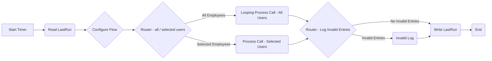
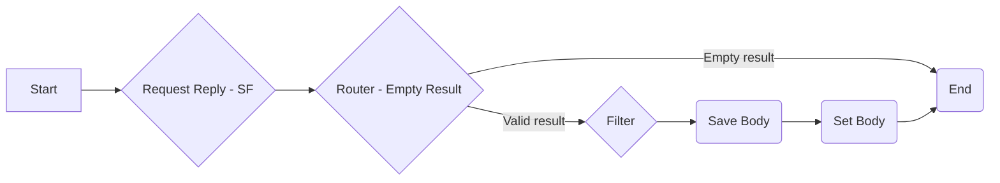
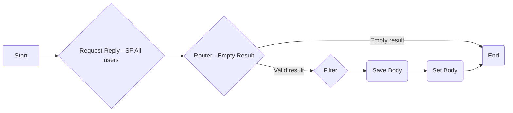
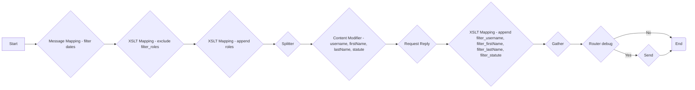
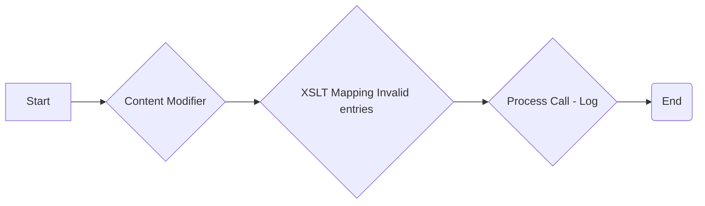
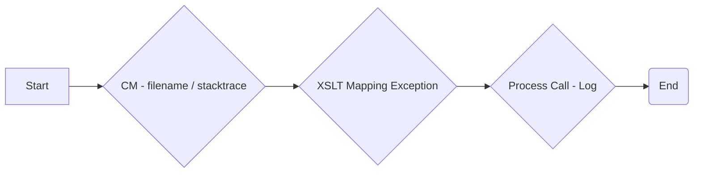
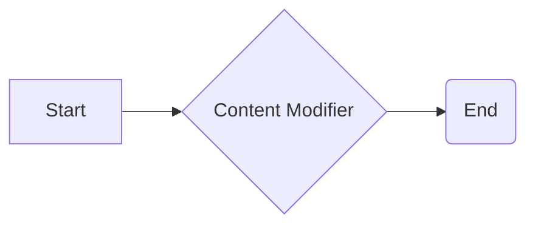
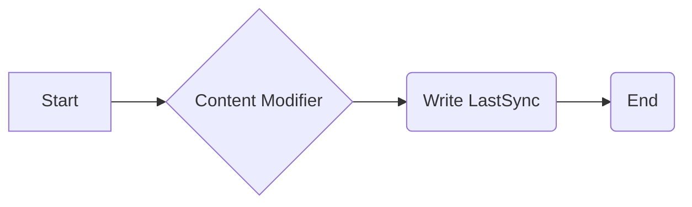
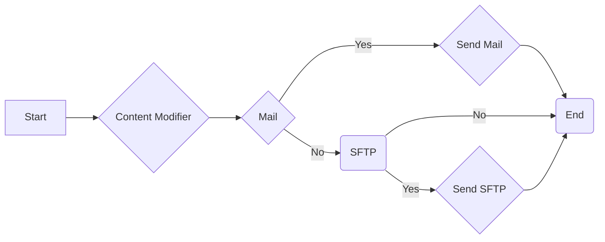

# Integration Flow Technical Specification

This document provides a detailed technical specification for the integration flows developed in SAP Cloud Integration. It outlines each process, its initiation points, and the individual steps involved, including configuration details.

## Process Overview

The integration flow consists of several interconnected processes, each designed to handle specific tasks related to user data synchronization and logging. Below is a high-level overview of the main processes:

1.  **Integration Process:** The main process that orchestrates the entire integration flow, responsible for reading last run data, processing user data, logging invalid entries, and writing the last run timestamp.
2.  **Local Integration Process Selected Users:** A sub-process responsible for fetching and processing data for a selection of users.
3.  **Local Looping Integration Process All Users:** A sub-process responsible for fetching and processing data for all users.
4.  **Process Employee:** A sub-process responsible for processing a single employee's data, applying transformations, and calling an external API.
5.  **Invalid Log:** A sub-process responsible for logging invalid data.
6.  **Extract Error Process:** A sub-process responsible for logging system exceptions.
7.  **Read LastRun:** A sub-process responsible for reading the last run timestamp.
8.  **Write LastRun:** A sub-process responsible for writing the current run timestamp.
9.   **Log:** A sub-process responsible for logging data to email and/or SFTP.

## Integration Flow Initiation

The main integration flow is initiated by a timer event.

**Start Timer**: The integration flow starts automatically based on a configured schedule. This event triggers the `Integration Process`.

## Detailed Process Description

### 1. Integration Process

The main process that orchestrates the entire integration flow.

 

**Steps:**

1.  **Start Timer:**
    *   **Type:** `StartEvent`
    *   **Description:** Initiates the main integration flow based on a predefined schedule.
    *   **Outgoing:** `Read LastRun`

2.  **Read LastRun:**
    *   **Type:** `CallLocalProcess`
    *   **Description:** Calls the `Read LastRun` sub-process to fetch the timestamp of the last successful run.
    *   **Outgoing:** `Configure Flow`
    *   **Call Process ID:** `Process_75333694`

3.  **Configure Flow:**
    *   **Type:** `ContentModifier`
    *   **Description:** Sets various properties that control the behavior of the integration flow.
    *   **Outgoing:** `Router - all / selected users`
    *   **Content Modifier Properties:**

        | Property Name        | Action | Type     | Value                    |
        | :------------------- | :----- | :------- | :----------------------- |
        | `RolesToExclude`      | Create | constant | `{{Roles_To_Exclude}}`   |
        | `queryusernames`     | Create | constant | `{{SF_Query_usernames}}`  |
        | `processDirectUrl`   | Create | constant | `{{ProcessDirect_Url}}`  |
        | `debuggingEnabled`   | Create | constant | `{{Debugging_Enabled}}`  |
        | `emailFrom`          | Create | constant | `{{Email_From}}`          |
        | `EmailNotificationsEnabled` | Create | constant | `{{Email_Notifications_Enabled}}` |
        | `SFTPLoggingEnabled`  | Create | constant | `{{SFTP_Logging_Enabled}}`  |
        | `emailRecipients`    | Create | constant | `{{Email_Recipients}}`    |
        | `processAllEmployees`| Create | constant | `{{All_Employees}}`        |

4.  **Router - all / selected users:**
    *   **Type:** `router`
    *   **Description:** Routes the flow based on the `processAllEmployees` property.
    *   **Outgoing (All Employees):** `Looping Process Call - All Users`
    *   **Condition:** `${property.processAllEmployees} = 'true'`
    *   **Outgoing (Selected Employees):** `Process Call - Selected Users`
    *   **Condition:** Default Expression

5.  **Looping Process Call - All Users:**
    *   **Type:** `CallLocalProcess`
    *   **Description:** Calls the `Local Looping Integration Process All Users` sub-process to fetch and process all user data.
    *   **Outgoing:** `Router - Log Invalid Entries`
    *   **Call Process ID:** `Process_75333180`

6.  **Process Call - Selected Users:**
    *   **Type:** `CallLocalProcess`
    *   **Description:** Calls the `Local Integration Process Selected Users` sub-process to fetch and process selected user data.
    *   **Outgoing:** `Router - Log Invalid Entries`
    *   **Call Process ID:** `Process_75333176`

7.   **Router - Log Invalid Entries:**
    *   **Type:** `router`
    *   **Description:** Routes the flow based on whether there are any invalid entries detected in the previous steps.
    *   **Outgoing (Invalid Entries):** `Invalid Log`
    *    **Condition:** `count(/root/error) > 0`
    *   **Outgoing (No Invalid Entries):** `Write LastRun`
    *   **Condition:** Default Expression

8.  **Invalid Log:**
    *   **Type:** `CallLocalProcess`
    *   **Description:** Calls the `Invalid Log` sub-process to log any invalid data.
    *    **Outgoing:** `Write LastRun`
    *   **Call Process ID:** `Process_75333867`

9.  **Write LastRun:**
    *   **Type:** `CallLocalProcess`
    *   **Description:** Calls the `Write LastRun` sub-process to write the timestamp of the current run.
    *   **Outgoing:** `End`
    *   **Call Process ID:** `Process_75333701`

10. **End:**
    *   **Type:** `endEvent`
    *   **Description:** Marks the end of the integration flow.

### 2. Local Integration Process Selected Users

This process is responsible for fetching and processing data for a selection of users.

 

**Steps:**

1.  **Start:**
    *   **Type:** `StartEvent`
    *   **Description:**  Initiates the sub-process.
    *   **Outgoing:** `Request Reply - SF`

2.  **Request Reply - SF:**
    *   **Type:** `API_CALL`
    *   **Description:** Calls the SuccessFactors OData API to retrieve user data for selected users.
        *  **Adapter:** `SuccessFactorsODataSingleUser`
        *  **Receiver:** `SF`
    *   **Outgoing:** `Router - Empty Result`

3.  **Router - Empty Result:**
    *   **Type:** `router`
    *   **Description:** Checks if the result from the SuccessFactors API is empty.
    *   **Outgoing (Empty Result):** `End`
    *   **Condition:** `not(//User/User/node())`
     *   **Outgoing (Valid Result):** `Filter`
     *   **Condition:** Default Expression

4.  **Filter:**
    *   **Type:** (Implicit)
     *   **Description:** Placeholder for filter process
    *   **Outgoing:** `Save Body`

5.  **Save Body:**
    *   **Type:** `ContentModifier`
    *   **Description:** Appends the current message body to a stored property `savedBody`.
    *   **Outgoing:** `Set Body`
    *   **Content Modifier Properties:**

        | Property Name | Action | Type       | Value               |
        | :------------ | :----- | :--------- | :------------------ |
        | `savedBody`   | Create | expression | `${property.savedBody}${body}` |

6. **Set Body:**
    *   **Type:** (Implicit)
    *    **Description:** Placeholder for setting the body
    *    **Outgoing:** `End`

7.  **End:**
    *   **Type:** `endEvent`
    *   **Description:**  Marks the end of the sub-process.

### 3. Local Looping Integration Process All Users

This process is responsible for fetching and processing data for all users.

 

**Steps:**

1.  **Start:**
    *   **Type:** `StartEvent`
    *   **Description:** Initiates the sub-process.
    *   **Outgoing:** `Request Reply - SF All users`

2.  **Request Reply - SF All users:**
    *   **Type:** `API_CALL`
    *   **Description:** Calls the SuccessFactors OData API to retrieve data for all users.
        *  **Adapter:** `SuccessFactorsODataAllUsers`
        *  **Receiver:** `SF`
    *   **Outgoing:** `Router - Empty Result`

3.  **Router - Empty Result:**
    *   **Type:** `router`
    *   **Description:** Checks if the result from the SuccessFactors API is empty.
    *   **Outgoing (Empty Result):** `End`
    *   **Condition:** `not(//User/User/node())`
    *  **Outgoing (Valid Result):** `Filter`
    *  **Condition:** Default Expression

4.  **Filter:**
    *    **Type:** (Implicit)
    *    **Description:** Placeholder for filtering
    *   **Outgoing:** `Save Body`

5. **Save Body:**
    *   **Type:** `ContentModifier`
    *   **Description:** Appends the current message body to a stored property `savedBody`.
    *   **Outgoing:** `Set Body`
    *   **Content Modifier Properties:**

        | Property Name | Action | Type       | Value               |
        | :------------ | :----- | :--------- | :------------------ |
        | `savedBody`   | Create | expression | `${property.savedBody}${body}` |

6. **Set Body:**
    *   **Type:** (Implicit)
    *    **Description:** Placeholder for setting the body
    *    **Outgoing:** `End`

7.  **End:**
    *   **Type:** `endEvent`
    *   **Description:** Marks the end of the sub-process.

### 4. Process Employee

This process is responsible for processing a single employee's data.

 

**Steps:**

1.  **Start:**
    *   **Type:** `StartEvent`
    *   **Description:** Initiates the sub-process for a single employee.
    *   **Outgoing:** `Message Mapping - filter dates`

2.  **Message Mapping - filter dates:**
    *   **Type:** `MessageMapping`
    *   **Description:**  Applies message mapping to filter date nodes.
    *  **Mapping Name Resource:** `MM_SFSF_Filter_Nodes_Dates`
    *   **Outgoing:** `XSLT Mapping - exclude filter_roles`

3.  **XSLT Mapping - exclude filter_roles:**
    *   **Type:** `XSLTMapping`
    *   **Description:** Applies an XSLT script to exclude certain roles from the employee data.
    *   **XSLTScriptResource:** `excludefilter_roles`
    *   **Outgoing:** `XSLT Mapping - append roles`

4.  **XSLT Mapping - append roles:**
    *   **Type:** `XSLTMapping`
    *   **Description:**  Applies an XSLT script to append roles to the employee data.
    *    **XSLTScriptResource:** `append_roles`
    *   **Outgoing:** `Splitter`

5.  **Splitter:**
     *   **Type:** (Implicit)
     *   **Description:** Placeholder for splitter functionality
     *   **Outgoing:** `Content Modifier - username, firstName, lastName, statute`

6. **Content Modifier - username, firstName, lastName, statute:**
    *   **Type:** (Implicit)
    *    **Description:** Placeholder for content modification functionality.
    *   **Outgoing:** `Request Reply`

7.  **Request Reply:**
    *   **Type:** `API_CALL`
    *   **Description:** Calls the ProcessDirect API to retrieve additional information about the employee.
        *  **Adapter:** `ProcessDirect-EDS-AzureAD`
        *  **Receiver:** `Receiver-ProcessDirect-EDS-AzureAD`
    *   **Outgoing:** `XSLT Mapping - append filter_username, filter_firstName, filter_lastName, filter_statute`

8.   **XSLT Mapping - append filter_username, filter_firstName, filter_lastName, filter_statute:**
    *   **Type:** `XSLTMapping`
    *   **Description:**  Applies an XSLT script to append filtered username, first name, last name and statute data.
    *    **XSLTScriptResource:** `appendfilter_username`
    *   **Outgoing:** `Gather`

9.  **Gather:**
    *   **Type:** (Implicit)
     *   **Description:** Placeholder for gather functionality.
    *   **Outgoing:** `Router  debug`

10. **Router  debug:**
    *   **Type:** `router`
    *   **Description:**  Routes the flow based on the value of the `debuggingEnabled` property.
    *    **Outgoing (Yes):** `Send`
    *   **Condition:** `${property.debuggingEnabled} = 'true'`
    *   **Outgoing (No):** `End`
    *    **Condition:** Default Expression

11. **Send:**
    *   **Type:** `API_CALL`
    *   **Description:** Sends the processed employee data to the SFTP-Log.
        *  **Adapter:** `SFTP-Process-Employee-InvalidADUsers`
        *  **Receiver:** `SFTP-Log`
    *   **Outgoing:** `End`

12. **End:**
    *   **Type:** `endEvent`
    *   **Description:**  Marks the end of the sub-process.

### 5. Invalid Log

This process is responsible for logging invalid data.

 

**Steps:**

1.  **Start:**
    *   **Type:** `StartEvent`
    *   **Description:** Initiates the sub-process for logging invalid data.
    *   **Outgoing:** `Content Modifier`

2.  **Content Modifier:**
    *   **Type:** `ContentModifier`
    *   **Description:** Creates a filename property using an expression with current date.
    *   **Outgoing:** `XSLT Mapping Invalid entries`
    *   **Content Modifier Properties:**

        | Property Name | Action | Type       | Value                     |
        | :------------ | :----- | :--------- | :------------------------ |
        | `filename`    | Create | expression | `invalid_${date:now:yyyyMMdd}.xml` |

3.  **XSLT Mapping Invalid entries:**
    *   **Type:** `XSLTMapping`
    *   **Description:**  Applies an XSLT script to map the invalid data.
    *    **XSLTScriptResource:** `xmlinvalidlogging`
    *   **Outgoing:** `Process Call - Log`

4.  **Process Call - Log:**
    *   **Type:** `CallLocalProcess`
    *   **Description:** Calls the `Log` sub-process to send a log.
    *   **Outgoing:** `End`
    *    **Call Process ID:** `Process_75333029`

5.  **End:**
    *   **Type:** `endEvent`
    *   **Description:** Marks the end of the sub-process.

### 6. Extract Error Process

This process is responsible for logging system exceptions.

 

**Steps:**

1.  **Start:**
    *   **Type:** `StartEvent`
    *   **Description:** Initiates the sub-process for logging exceptions.
    *   **Outgoing:** `CM - filename / stacktrace`

2.  **CM - filename / stacktrace:**
    *   **Type:** `ContentModifier`
    *   **Description:** Creates properties to store the exception message and stack trace and sets the filename.
    *   **Outgoing:** `XSLT Mapping Exception`
       *    **Content Modifier Properties:**

        | Property Name                | Action | Type       | Value                        |
        | :--------------------------- | :----- | :--------- | :--------------------------- |
        | `exception_message_to_escape` | Create | expression | `exception.message`           |
          | `filename` | Create | expression |  `general_error_${date:now:yyyyMMdd}.xml`            |
        | `exception_to_escape`       | Create | expression | `exception.stacktrace`        |

3.  **XSLT Mapping Exception:**
    *   **Type:** `XSLTMapping`
    *   **Description:** Applies an XSLT script to map the exception data.
    *    **XSLTScriptResource:** `Exception`
    *   **Outgoing:** `Process Call - Log`

4.  **Process Call - Log:**
    *   **Type:** `CallLocalProcess`
    *   **Description:** Calls the `Log` sub-process to send an email and/or log to SFTP.
    *   **Outgoing:** `End`
    *    **Call Process ID:** `Process_75333029`

5.  **End:**
    *   **Type:** `endEvent`
    *   **Description:**  Marks the end of the sub-process.

### 7. Read LastRun

This process is responsible for reading the last run timestamp.

 

**Steps:**

1.  **Start:**
    *   **Type:** `StartEvent`
    *   **Description:** Initiates the sub-process for reading the last run timestamp.
    *   **Outgoing:** `Content Modifier`

2.  **Content Modifier:**
    *   **Type:** `ContentModifier`
    *   **Description:** Placeholder for content modifier.
    *   **Outgoing:** `End`

3.  **End:**
    *   **Type:** `endEvent`
    *   **Description:** Marks the end of the sub-process.

### 8. Write LastRun

This process is responsible for writing the current run timestamp.

 

**Steps:**

1.  **Start:**
    *   **Type:** `StartEvent`
    *   **Description:** Initiates the sub-process for writing the current run timestamp.
    *   **Outgoing:** `Content Modifier`

2.  **Content Modifier:**
    *   **Type:** `ContentModifier`
    *   **Description:** Sets the current date and time as `thisRun`
    *   **Outgoing:** `Write LastSync`
        *   **Content Modifier Properties:**

        | Property Name | Action | Type       | Value                        |
        | :------------ | :----- | :--------- | :--------------------------- |
        | `thisRun`       | Create | expression | `${date:now:YYYY-MM-dd'T'HH:mm:ss.SSSXXX}`       |

3.  **Write LastSync:**
    *   **Type:** (Implicit)
    *    **Description:** Placeholder for write last sync functionality
    *    **Outgoing:** `End`

4.  **End:**
    *   **Type:** `endEvent`
    *   **Description:**  Marks the end of the sub-process.

### 9. Log

This process is responsible for logging data to email and/or SFTP.

 

**Steps:**

1.  **Start:**
    *   **Type:** `StartEvent`
    *   **Description:** Initiates the sub-process for logging data.
    *   **Outgoing:** `Content Modifier`

2.  **Content Modifier:**
    *   **Type:** `ContentModifier`
    *   **Description:** Extracts email properties from the message body.
    *   **Outgoing:** `Mail`
    *   **Content Modifier Properties:**

        | Property Name | Action | Type  | Value                    |
        | :------------ | :----- | :---- | :----------------------- |
        | `mail_from`   | Create | xpath | `/mailOutput/from/text()` |
        | `mail_title`  | Create | xpath | `/mailOutput/title/text()`|
        | `mail_to`     | Create | xpath | `/mailOutput/recipients/text()`   |
        | `mail_body`   | Create | xpath | `/mailOutput/body/text()`   |

3.  **Mail:**
    *   **Type:** `router`
    *   **Description:** Routes the flow based on the value of the `EmailNotificationsEnabled` property.
    *   **Outgoing (Yes):** `Send Mail`
    *    **Condition:** `${property.EmailNotificationsEnabled} = 'true'`
    *   **Outgoing (No):** `SFTP`
    *    **Condition:** Default Expression

4. **SFTP:**
    *  **Type:** `router`
    *   **Description:** Routes the flow based on the value of the `SFTPLoggingEnabled` property.
    *    **Outgoing (Yes):** `Send SFTP`
    *   **Condition:** `${property.SFTPLoggingEnabled} = 'true'`
    *  **Outgoing (No):** `End`
    *  **Condition:** Default Expression

5.  **Send Mail:**
    *   **Type:** `API_CALL`
    *   **Description:** Sends an email using the configured email adapter.
        *   **Adapter:** `Mail-Exceptions`
        *   **Receiver:** `Receiver-Email`
    *   **Outgoing:** `End`

6.  **Send SFTP:**
    *   **Type:** `API_CALL`
    *   **Description:** Sends a log entry to the configured SFTP server.
        *  **Adapter:** `SFTP-Error`
        *  **Receiver:** `SFTP-Log`
    *    **Outgoing:** `End`

7.  **End:**
    *   **Type:** `endEvent`
    *   **Description:**  Marks the end of the sub-process.

This document provides a comprehensive overview of each process within the integration flow. New team members should be able to understand the logic and flow of data by carefully reviewing these descriptions.
