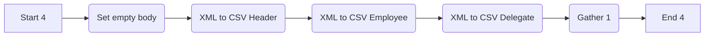
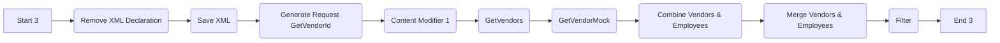
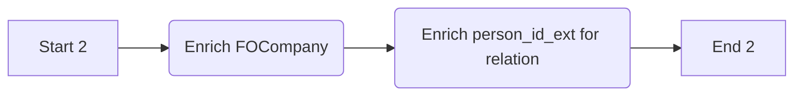
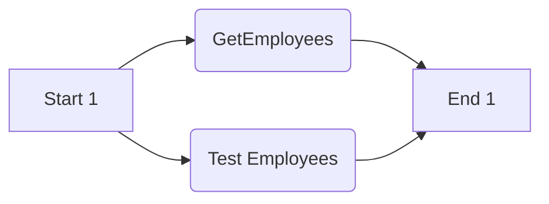

```markdown
# Integration Flow Technical Specification

This document provides a detailed technical specification for the SAP Cloud Integration flow, encompassing various processes and steps involved in transforming and transferring employee data.

## Process Overview

This integration flow is designed to extract employee data from SuccessFactors (SFSF), enrich it with additional information from SAP ERP, transform it into a CSV format, and then send it to a Concur SFTP server. The integration flow consists of several interconnected processes, each responsible for a specific aspect of data handling and transformation. 

The main integration flow is started via a ProcessDirect call or a scheduler. The following diagram shows the main integration flow.

```mermaid
graph LR
    A[Start] --> B(Get Employees from SFSF);
    B --> C(Enrich from SFSF);
    C --> D(Get Vendors from SAP ERP);
    D --> E(Set Highest Direct Reports);
    E --> F(Filter current nodes);
    F --> G(Remove nodes without Person);
    G --> H(Keep newest employment);
    H --> I(Remove employees with company code C628 and country code not Norway);
    I --> J(Remove unpaid leave employees);
    J --> K(Remove employment_information and job_information with lower fte);
    K --> L(XML to CSV);
    L --> M(AddBOM);
    M --> N{Router};
    N -- Route 1 --> O(PGPEncryptor 1);
    N -- Route 2 --> P(Skip encryption for testing);
    O --> Q(Log Msg);
    P --> Q;
    Q --> R(Concur SFTP);
    R --> S[End];
```



## Integration Flow Initiation

The integration flow can be initiated in two ways:

1.  **ProcessDirect:** This allows for on-demand triggering of the integration flow via an API call to the `ProcessDirect` adapter. This is described in detail in the section **Start from ProcessDirect**
2.  **Scheduler:** The integration flow can be scheduled to run at specific time intervals, using a timer-based start event. This is described in detail in the section **Scheduler**

## Detailed Process Description

This section describes all the processes in detail. The processes are described in the order they are called.

### Start from ProcessDirect

This process defines how the integration flow can be started with a ProcessDirect call.


**1. Start 5:**

*   **Type:** `StartEvent`
*   **Description:** This step initiates the integration flow when called using the `ProcessDirect` adapter.
*   **Sender Adapter:**
    *   **Name:** ProcessDirect
    *   **Component Type:** ProcessDirect

**2. Config Flow from Headers:**

*   **Type:** `ContentModifier`
*   **Description:** This step sets various headers that are used later on in the integration flow. The values for the headers are provided via the API call.
*   **Content Modifier Properties:**

    | Property Name          | Action | Type   | Value                   | Default | Datatype |
    | :--------------------- | :----- | :----- | :---------------------- | :------ | :------- |
    | Concur\_SFTP\_Directory | Create | header | Concur\_SFTP\_Directory |         |          |
    | SkipDelegates          | Create | header | SkipDelegates           |         |          |
    | CashAdvanceAccountCode  | Create | header | CashAdvanceAccountCode  |         |          |
    | TestUsersSFSF          | Create | header | TestUsersSFSF          |         |          |
    | CompanyListSFSF        | Create | header | CompanyListSFSF        |         |          |
    | InactiveDaysSF         | Create | header | InactiveDaysSF         |         |          |
    | skipEncryption         | Create | header | skipEncryption         |         |          |
    | local\_log             | Create | header | local\_log             |         |          |
    | LogicalSystem          | Create | header | LogicalSystem          |         |          |

**3. Main Process:**

*   **Type:** `CallLocalProcess`
*   **Description:** This step calls the main integration flow process named `Main Process`.

**4. End:**

*   **Type:** `endEvent`
*   **Description:** This step marks the end of the `Start from ProcessDirect` process.

### Scheduler

This process defines how the integration flow can be started with a scheduler.


**1. Start Timer 1:**

*   **Type:** `StartEvent`
*   **Description:** This step initiates the integration flow based on a predefined schedule configured in the integration flow's properties.

**2. Config Flow:**

*   **Type:** `ContentModifier`
*   **Description:** This step sets various constants that are used later on in the integration flow. The values for the constants are provided via parameters in the integration flow configuration.
*   **Content Modifier Properties:**

    | Property Name          | Action | Type       | Value                   | Default | Datatype |
    | :--------------------- | :----- | :--------- | :---------------------- | :------ | :------- |
    | Concur\_SFTP\_Directory | Create | constant   | {{Concur\_SFTP\_Directory}} |         |          |
    | SkipDelegates          | Create | constant   | {{SkipDelegates}}           |         |          |
    | CashAdvanceAccountCode  | Create | constant   | {{CashAdvanceAccountCode}}  |         |          |
    | TestUsersSFSF          | Create | expression | {{TestUsersSFSF}}          |         |          |
    | CompanyListSFSF        | Create | constant   | {{CompanyListSFSF}}        |         |          |
    | InactiveDaysSF         | Create | constant   | {{InactiveDaysSF}}         |         |          |
    | skipEncryption         | Create | constant   | {{skip_encryption}}         |         |          |
    | local\_log             | Create | constant   | {{enable_log}}             |         |          |
    | LogicalSystem          | Create | constant   | {{LogicalSystem}}          |         |          |

**3. Main Process:**

*   **Type:** `CallLocalProcess`
*   **Description:** This step calls the main integration flow process named `Main Process`.

**4. End 5:**

*   **Type:** `endEvent`
*   **Description:** This step marks the end of the `Scheduler` process.

### Main Process

This process is the central part of the integration flow. It orchestrates the data extraction, transformation, and delivery.

```mermaid
graph LR
    A[Start 6] --> B(Get Employees from SFSF);
    B --> C(Enrich from SFSF);
    C --> D(Get Vendors from SAP ERP);
    D --> E(Set Highest Direct Reports);
    E --> F(Filter current nodes);
    F --> G(Remove nodes without Person);
    G --> H(Keep newest employment);
    H --> I(Remove employees with company code C628 and country code not Norway);
    I --> J(Remove unpaid leave employees);
    J --> K(Remove employment_information and job_information with lower fte);
    K --> L(XML to CSV);
    L --> M(AddBOM);
    M --> N{Router 1};
     N -- Route 1 --> O(PGPEncryptor 1);
    N -- Route 2 --> P(Skip encryption for testing);
    O --> Q(Log Msg);
    P --> Q;
    Q --> R(Concur SFTP);
    R --> S[End 6];
```



**1. Start 6:**

*   **Type:** `StartEvent`
*   **Description:** This step initiates the `Main Process` of the integration flow.

**2. Get Employees from SFSF:**

*   **Type:** `CallLocalProcess`
*   **Description:** This step calls the `Get Employees from SFSF` process to retrieve employee data from SuccessFactors.

**3. Enrich from SFSF:**

*  **Type:** `CallLocalProcess`
*  **Description:** This step calls the `Enrich from SFSF` process to enrich the employee data with additional information from SuccessFactors, such as company details and person ID's.

**4. Get Vendors from SAP ERP:**

*   **Type:** `CallLocalProcess`
*   **Description:** This step calls the `Get Vendors from SAP ERP` process to retrieve vendor data from SAP ERP.

**5. Set Highest Direct Reports:**

*   **Type:** `ContentModifier`
*   **Description:** This step will be responsible for setting the highest direct reports for the employee.
    * No additional details were provided for this step.

**6. Filter current nodes:**

*  **Type:** `ContentModifier`
*  **Description:** This step filters the current nodes based on criteria that are not provided.
    * No additional details were provided for this step.

**7. Remove nodes without Person:**

*   **Type:** `ContentModifier`
*   **Description:** This step removes any data nodes that do not contain person details.
    * No additional details were provided for this step.

**8. Keep newest employment:**

*  **Type:** `ContentModifier`
*  **Description:** This step keeps the newest employment record for each employee, removing older employment data.
    * No additional details were provided for this step.

**9. Remove employees with company code C628 and country code not Norway:**

*  **Type:** `ContentModifier`
*  **Description:** This step filters out employees who have a company code of "C628" and a country code that is not Norway.
    * No additional details were provided for this step.

**10. Remove unpaid leave employees:**

*  **Type:** `ContentModifier`
*  **Description:** This step removes employees who have unpaid leave.
    * No additional details were provided for this step.

**11. Remove employment\_information and job\_information with lower fte:**

*  **Type:** `ContentModifier`
*  **Description:** This step removes employment and job information for employees that have a lower FTE (Full-Time Equivalent).
    * No additional details were provided for this step.

**12. XML to CSV:**

*   **Type:** `CallLocalProcess`
*   **Description:** This step calls the `XML to CSV` process to transform the employee data from XML to CSV format.

**13. AddBOM:**

*   **Type:** `ContentModifier`
*   **Description:** This step adds a Byte Order Mark (BOM) to the CSV file.
    * No additional details were provided for this step.

**14. Router 1:**

*   **Type:** `router`
*   **Description:** This step routes the message based on whether encryption should be skipped or not.
*   **Routing Conditions:**
    *   **Route 2:** If the header `skipEncryption` is equal to `true`, the message is routed to the `Skip encryption for testing` step. Condition Expression: `${property.skipEncryption} = 'true'`
    *   **Route 1:** If the header `skipEncryption` is not equal to `true`, the message is routed to the `PGPEncryptor 1` step. Condition Expression: `DefaultExpression`

**15. PGPEncryptor 1:**

*   **Type:** `ContentModifier`
*  **Description:** This step is responsible for encrypting the outgoing payload with PGP.
   * No additional details were provided for this step.

**16. Skip encryption for testing:**
*   **Type:** `ContentModifier`
*   **Description:** This step is a placeholder for skipping encryption during testing.
     * No additional details were provided for this step.

**17. Log Msg:**

*   **Type:** `ContentModifier`
*  **Description:** This step is used to log the message details.
    * No additional details were provided for this step.

**18. Concur SFTP:**

*   **Type:** `API_CALL`
*   **Description:** This step sends the transformed CSV file to the Concur SFTP server.
*   **Adapter:** SFTP
*   **Receiver:** Concur\_SFTP

**19. End 6:**

*   **Type:** `endEvent`
*   **Description:** This step marks the end of the `Main Process` process.

### XML to CSV

This process transforms XML data to CSV format.



**1. Start 4:**

*   **Type:** `StartEvent`
*   **Description:** This step initiates the `XML to CSV` process.

**2. Set empty body:**

*   **Type:** `ContentModifier`
*   **Description:** This step sets the message body to empty before the processing of the XML to CSV steps start.
     * No additional details were provided for this step.

**3. XML to CSV Header:**

*   **Type:** `ContentModifier`
*   **Description:** This step transforms the header data within the XML structure into a CSV row.
     * No additional details were provided for this step.

**4. XML to CSV Employee:**

*   **Type:** `ContentModifier`
*   **Description:** This step transforms the employee data within the XML structure into a CSV row.
     * No additional details were provided for this step.

**5. XML to CSV Delegate:**

*  **Type:** `ContentModifier`
*  **Description:** This step transforms the delegate data within the XML structure into a CSV row.
     * No additional details were provided for this step.

**6. Gather 1:**

*   **Type:** `ContentModifier`
*   **Description:** This step is responsible for gathering the results of the previous XML to CSV steps.
     * No additional details were provided for this step.

**7. End 4:**

*   **Type:** `endEvent`
*   **Description:** This step marks the end of the `XML to CSV` process.

### Get Vendors from SAP ERP

This process retrieves vendor data from SAP ERP.



**1. Start 3:**

*   **Type:** `StartEvent`
*   **Description:** This step initiates the `Get Vendors from SAP ERP` process.

**2. Remove XML Declaration:**

*   **Type:** `ContentModifier`
*   **Description:** This step removes the XML declaration from the message body.
    * No additional details were provided for this step.

**3. Save XML:**

*   **Type:** `ContentModifier`
*   **Description:** This step saves the XML message to a property called `employeeXML`
*   **Content Modifier Properties:**

    | Property Name | Action | Type       | Value     | Default | Datatype |
    | :------------ | :----- | :--------- | :-------- | :------ | :------- |
    | employeeXML   | Create | expression | `${in.body}` |         |          |

**4. Generate Request GetVendorId:**

*   **Type:** `ContentModifier`
*   **Description:** This step generates the request to retrieve the vendor ID.
    * No additional details were provided for this step.

**5. Content Modifier 1:**
*  **Type:** `ContentModifier`
*  **Description:** This step is a placeholder step and no additional details were provided.
    * No additional details were provided for this step.

**6. GetVendors:**

*   **Type:** `API_CALL`
*   **Description:** This step calls the SAP ERP system to retrieve vendor details.
*   **Adapter:** SOAP
*   **Receiver:** SAP\_ERP
*   **API credential Name:** {{ECC\_CRED}}

**7. GetVendorMock:**

*   **Type:** `API_CALL`
*   **Description:** This step retrieves vendor details from a mock endpoint.
*   **Adapter:** SOAP
*   **Receiver:** Mock

**8. Combine Vendors & Employees:**

*  **Type:** `ContentModifier`
*  **Description:** This step combines the employee data with the vendor data
   * No additional details were provided for this step.

**9. Merge Vendors & Employees:**

*   **Type:** `ContentModifier`
*   **Description:** This step merges the vendor and employee data.
    * No additional details were provided for this step.

**10. Filter:**

*   **Type:** `ContentModifier`
*   **Description:** This step filters the merged vendor and employee data.
    * No additional details were provided for this step.

**11. End 3:**

*   **Type:** `endEvent`
*   **Description:** This step marks the end of the `Get Vendors from SAP ERP` process.

### Enrich from SFSF

This process enriches the employee data with company details and person IDs from SuccessFactors.



**1. Start 2:**

*   **Type:** `StartEvent`
*   **Description:** This step initiates the `Enrich from SFSF` process.

**2. Enrich FOCompany:**

*   **Type:** `API_Enrichment`
*   **Description:** This step retrieves company details from SuccessFactors using the OData V2 protocol.
*   **Resource Path:** FOCompany
*   **Alias:** {{SF\_CRED}}
*   **Message Protocol:** OData V2
*   **Address:** {{SF\_URL}}
*   **Step Name:** Enrich FOCompany

**3. Enrich person\_id\_ext for relation:**

*   **Type:** `API_Enrichment`
*   **Description:** This step retrieves the person ID external for relation from SuccessFactors using the OData V2 protocol.
*   **Resource Path:** EmpEmployment
*   **Alias:** {{SF\_CRED}}
*   **Message Protocol:** OData V2
*   **Address:** {{SF\_URL}}
*   **Step Name:** Enrich person\_id\_ext for relation

**4. End 2:**

*   **Type:** `endEvent`
*   **Description:** This step marks the end of the `Enrich from SFSF` process.

### Get Employees from SFSF

This process retrieves employee data from SuccessFactors.



**1. Start 1:**

*   **Type:** `StartEvent`
*   **Description:** This step initiates the `Get Employees from SFSF` process.

**2. Test Employees:**

*   **Type:** `API_CALL`
*   **Description:** This step retrieves a subset of employees from SuccessFactors for testing purposes
*   **Adapter:** SuccessFactors
*  **Receiver:** SFSF_Test

**3. GetEmployees:**

*   **Type:** `API_CALL`
*   **Description:** This step retrieves employee details from SuccessFactors using SOAP.
*   **Adapter:** SuccessFactors
*   **Receiver:** SFSF\_SOAP

**4. End 1:**

*   **Type:** `endEvent`
*   **Description:** This step marks the end of the `Get Employees from SFSF` process.
```
