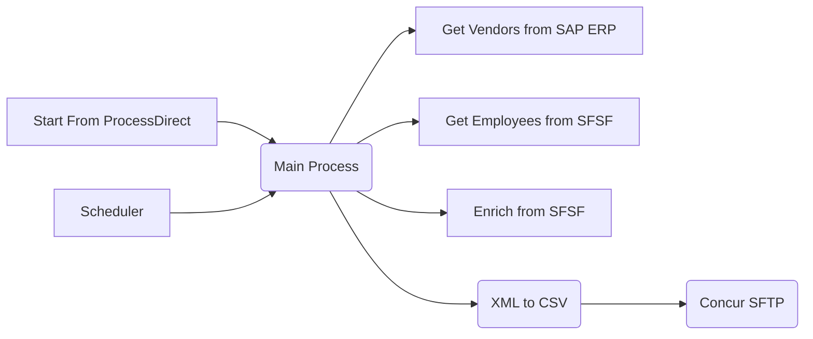
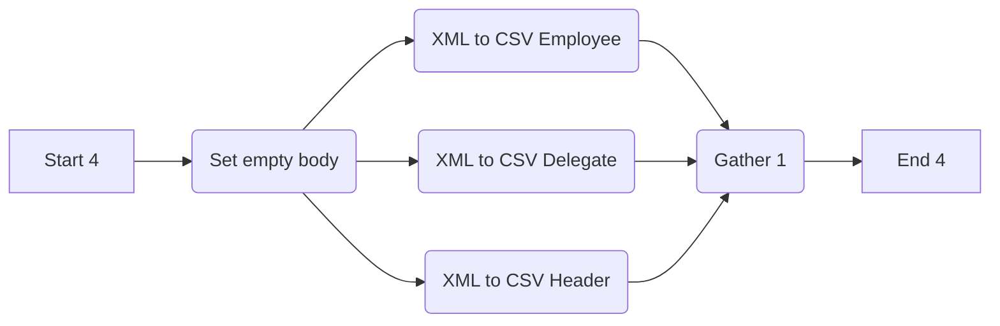
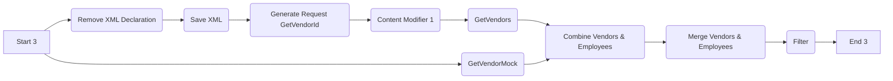
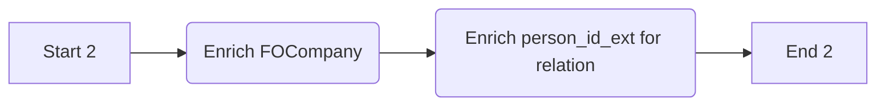
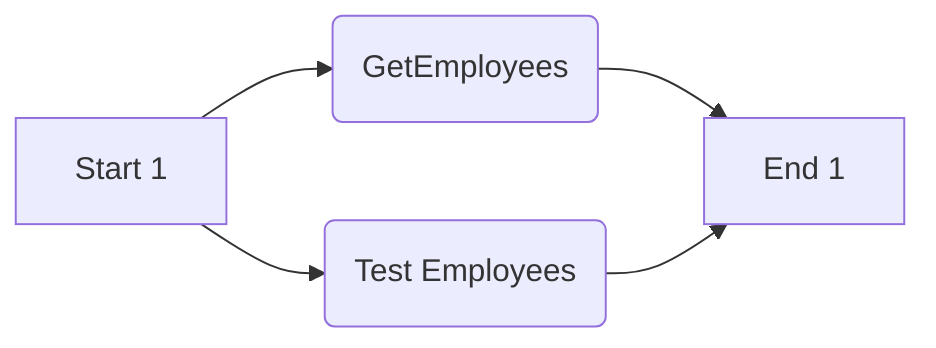

```markdown
# Integration Flow Technical Specification

This document provides a detailed technical specification for the SAP Cloud Integration flows, outlining each process, its initiation, and step-by-step logic. This is designed to help new team members quickly understand the integration.

## Process Overview

The integration flow consists of several interconnected processes that handle the extraction, transformation, and delivery of employee data from SuccessFactors to a Concur SFTP server.

The main flow (`Main Process`) orchestrates the retrieval of employee data from SuccessFactors, enrichment with additional data from SFSF and SAP ERP, and finally conversion and delivery to the Concur SFTP server. It also handles data filtering and transformations. This process can be triggered by two different ways as described in the `Integration Flow Initiation`. 

Here is a visualization of the main processes and their relationships:



## Integration Flow Initiation

The `Main Process` can be initiated via two different mechanisms:

1.  **ProcessDirect Adapter:**
    *   The integration flow can be triggered by another integration flow or application using the `ProcessDirect` adapter named `ProcessDirect`. This allows for synchronous invocation of the integration process.
2.  **Scheduler:**
    *   The integration flow can be triggered by a timer event. This allows the flow to be executed on a regular schedule.

## Detailed Process Description

### 1. `XML to CSV`

This process transforms an XML input into a CSV format.



1.  **Start 4:** The process begins with a start event.
2.  **Set empty body:** This step prepares the message by setting the body to be empty.
3.  **XML to CSV Employee**: This step transforms the XML data related to employees into CSV format.
4.  **XML to CSV Delegate**: This step transforms the XML data related to delegates into CSV format.
5.  **XML to CSV Header**: This step transforms the XML data related to headers into CSV format.
6.  **Gather 1:** This step combines the results of the previous transformations into a single message.
7.  **End 4:** The process concludes with an end event.

### 2. `Start from ProcessDirect`

This process initiates the main integration flow via a `ProcessDirect` adapter.


1.  **Start 5:** The process starts when triggered by the `ProcessDirect` adapter.
    *   **Sender Adapter:**
        *   **Name:** ProcessDirect
        *   **Component Type:** `ProcessDirect`
2.  **Config Flow from Headers:** A `Content Modifier` step that sets up various headers. The following headers are set:

    | Property Name        | Action | Type   | Value                    | Default | Datatype |
    |----------------------|--------|--------|--------------------------|---------|----------|
    | Concur\_SFTP\_Directory| Create | header |  |         |      |
    | SkipDelegates        | Create | header |                          |         |          |
    | CashAdvanceAccountCode| Create | header |                          |         |          |
    | TestUsersSFSF        | Create | header |                          |         |          |
    | CompanyListSFSF      | Create | header |                          |         |          |
    | InactiveDaysSF       | Create | header |                          |         |          |
    | skipEncryption       | Create | header |                          |         |          |
    | local\_log           | Create | header |                          |         |          |
    | LogicalSystem        | Create | header |                          |         |          |
3.  **Main Process:** Calls the `Main Process` sub-integration flow.
4.  **End:** The process ends.

### 3. `Scheduler`

This process initiates the main integration flow via a timer event.


1.  **Start Timer 1:** The process starts based on a configured timer schedule.
2.  **Config Flow:** A `Content Modifier` step that sets up various constants. The following constants are set:

    | Property Name        | Action   | Type     | Value                    | Default | Datatype |
    |----------------------|----------|----------|--------------------------|---------|----------|
    | Concur\_SFTP\_Directory| Create   | constant | `{{Concur_SFTP_Directory}}`     |    |          |
    | SkipDelegates        | Create   | constant |  `{{SkipDelegates}}`                         |    |          |
    | CashAdvanceAccountCode| Create   | constant |`{{CashAdvanceAccountCode}}`     |    |         |
     | TestUsersSFSF        | Create   | expression | `{{TestUsersSFSF}}` |         |          |
    | CompanyListSFSF      | Create   | constant |  `{{CompanyListSFSF}}`                        |   |        |
    | InactiveDaysSF       | Create   | constant | `{{InactiveDaysSF}}`                         |     |      |
    | skipEncryption       | Create   | constant | `{{skip_encryption}}`                         |      |       |
    | local\_log           | Create   | constant | `{{enable_log}}`                     |         |      |
    | LogicalSystem        | Create   | constant | `{{LogicalSystem}}`                           |        |       |
3.  **Main Process:** Calls the `Main Process` sub-integration flow.
4.  **End 5:** The process ends.

### 4.  `Get Vendors from SAP ERP`

This process retrieves vendor data from SAP ERP and combines it with employee data.



1.  **Start 3:** The process begins with a start event.
2.  **Remove XML Declaration:** This step removes the XML declaration from the incoming message.
3.  **Save XML:** A `Content Modifier` step stores the current message body in a property called `employeeXML` to be used later to merge data from SAP.

    | Property Name | Action | Type       | Value          | Default | Datatype |
    |---------------|--------|------------|----------------|---------|----------|
    | employeeXML   | Create | expression | `${in.body}`    |         |          |
4.  **Generate Request GetVendorId:** This step transforms the XML data to generate a request for retrieving vendor IDs using an `XSLTMapping`.
5.  **Content Modifier 1:**  This is a placeholder and does not modify any data.
6.  **GetVendors:** An `API_CALL` step that makes a call to the SAP ERP system to retrieve vendor data.
    *   **Adapter:** SOAP
    *   **Receiver:** SAP_ERP
    *  **Credential Name:** `{{ECC_CRED}}`
7.  **Combine Vendors & Employees:** This step combines the vendor data received from SAP ERP with employee data previously stored.
8.  **Merge Vendors & Employees:** This step performs the merging of vendor and employee data using an `XSLTMapping`.
9.  **Filter:** This is a placeholder and does not filter anything.
10. **End 3:** The process concludes with an end event.
11. **GetVendorMock:** An `API_CALL` step that mocks a call to the SAP ERP system.
    *   **Adapter:** SOAP
    *   **Receiver:** Mock

### 5. `Main Process`

This process is the main orchestration flow that handles the core logic of the integration.

```mermaid
graph LR
    A[Start 6] --> B(Get Employees from SFSF)
    B --> C(Remove nodes without Person)
     C --> D(Filter current nodes)
    D --> E(Keep newest employment)
     E --> F(Remove CompCodeC628AndCtryCodeNotNorway)
      F --> G(RemoveIncompleteEmployees)
       G --> H(RemoveUnpaidLeaveEmployees)
    H --> I(Enrich from SFSF)
    I --> J(Set Highest Direct Reports)
    J --> K(Get Vendors from SAP ERP)
    K --> L(Employee SF to Concur)
    L --> M(XML to CSV)
    M --> N(AddBOM)
     N --> O(Router 1)
    O -- Route 1 --> P(PGPEncryptor 1)
    O -- Route 2 --> Q(Skip encryption for testing)
    P --> R(Log Msg)
     Q --> R
      R --> S(Concur SFTP)
    S --> T[End 6]
```



1.  **Start 6:** The process begins with a start event.
2.  **Get Employees from SFSF:** Calls the `Get Employees from SFSF` sub-integration flow to retrieve employee data.
3. **Remove nodes without Person:** This step filters out XML nodes that don't have a Person using an `XSLTMapping`.
4. **Filter current nodes:** This is a placeholder and does not filter anything.
5.  **Keep newest employment:** This step uses `XSLTMapping` to retain only the newest employment information for each employee.
6.  **Remove employees with company code C628 and country code not Norway:** This step filters out employees that match the specified criteria using an `XSLTMapping`.
7.  **Remove incomplete Employees:** This step filters out incomplete employee entries using an `XSLTMapping`.
8.  **Remove unpaid leave employees:** This step filters out employees who are on unpaid leave using an `XSLTMapping`.
9.  **Enrich from SFSF:** Calls the `Enrich from SFSF` sub-integration flow to enrich employee data.
10. **Set Highest Direct Reports:**  This step uses an `XSLTMapping` to determine and set the highest direct reports for each employee.
11. **Get Vendors from SAP ERP:** Calls the `Get Vendors from SAP ERP` sub-integration flow to retrieve vendor data from SAP ERP.
12. **Employee SF to Concur:** This is a placeholder and does not modify any data.
13. **XML to CSV:** Calls the `XML to CSV` sub-integration flow to convert the data to CSV format.
14. **AddBOM:** This is a placeholder and does not modify any data.
15. **Router 1:** A router step that checks the `skipEncryption` header property.
    *   **Route 2:** If `skipEncryption` is `true`, the message is routed to the `Skip encryption for testing` step.
    *   **Route 1:** If `skipEncryption` is not `true`, the message is routed to the `PGPEncryptor 1` step.
16. **PGPEncryptor 1:** This step encrypts the data using PGP encryption.
17. **Skip encryption for testing:**  This is a placeholder and does not modify any data.
18. **Log Msg:** This step logs the message.
19. **Concur SFTP:** An `API_CALL` step that sends the data to the Concur SFTP server.
    *   **Adapter:** SFTP
    *   **Receiver:** Concur_SFTP
20. **End 6:** The process concludes with an end event.

### 6.  `Enrich from SFSF`

This process enriches employee data with additional information from SuccessFactors.



1.  **Start 2:** The process begins with a start event.
2.  **Enrich FOCompany:** This step enriches the employee data with the company information by calling the SuccessFactors API with the resource path `FOCompany` using an `API_Enrichment`.
    *   **Alias:** `{{SF_CRED}}`
    *   **Message Protocol:** `OData V2`
    *   **Address:** `{{SF_URL}}`
3.  **Enrich person\_id\_ext for relation:** This step enriches the employee data with the `person_id_ext` field by calling the SuccessFactors API with the resource path `EmpEmployment` using an `API_Enrichment`.
    *   **Alias:** `{{SF_CRED}}`
    *   **Message Protocol:** `OData V2`
    *   **Address:** `{{SF_URL}}`
4.  **End 2:** The process concludes with an end event.

### 7. `Get Employees from SFSF`

This process retrieves employee data from SuccessFactors.



1.  **Start 1:** The process begins with a start event.
2.  **GetEmployees:** An `API_CALL` step retrieves employee data from SuccessFactors.
    *   **Adapter:** SuccessFactors
    *   **Receiver:** SFSF_SOAP
3. **Test Employees:** An `API_CALL` step retrieves employee data from SuccessFactors.
     *  **Adapter:** SuccessFactors
     *   **Receiver:** SFSF_Test
4.  **End 1:** The process concludes with an end event.
```
