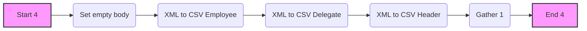
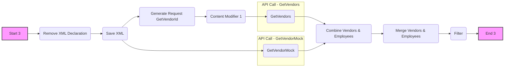
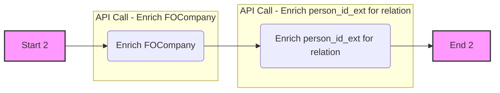
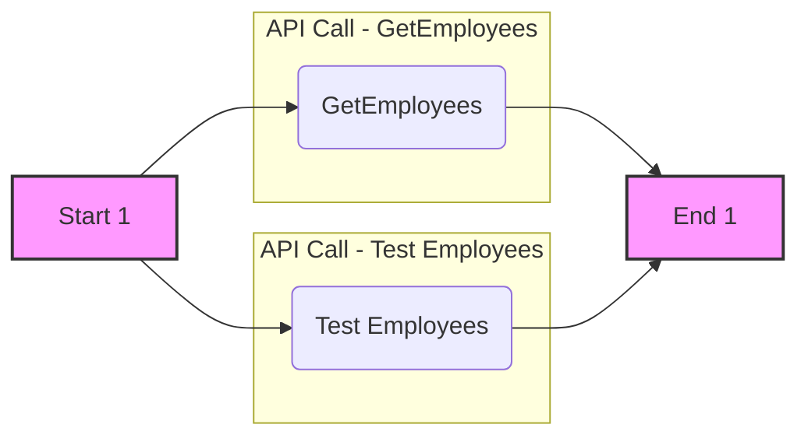

```markdown
# Integration Flow Technical Specification

This document provides a detailed technical specification for the integration flow, outlining each process, its steps, and relevant configurations. This document is intended to provide new team members with the necessary understanding of the flow logic.

## Process Overview

The integration flow is designed to extract employee data from SuccessFactors (SFSF), enrich it with additional information from SAP ERP, transform the data into a CSV format, and transfer it to a Concur SFTP server.

The main process consists of multiple sub-processes that are used to achieve the desired result:

- **Main Process:** Orchestrates the overall data extraction, transformation, and transfer.
- **Get Employees from SFSF:** Retrieves employee data from SuccessFactors.
- **Enrich from SFSF:** Enriches the employee data with additional information from SuccessFactors.
- **Get Vendors from SAP ERP:** Retrieves vendor data from SAP ERP.
- **XML to CSV:** Converts XML data to CSV format.
- **Start from ProcessDirect:** Allows initiation of the integration flow via ProcessDirect adapter.
- **Scheduler:** Allows initiation of the integration flow via a timer.

The following diagram gives an overview of the main integration flow:

```mermaid
graph LR
    A[Start Event] --> B(Get Employees from SFSF);
    B --> C(Remove unpaid leave employees);
    C --> D(Enrich from SFSF);
    D --> E(Remove employees with company code C628 and country code not Norway);
    E --> F(Keep newest employment);
     F --> G(Filter current nodes);
     G --> H(Remove nodes without Person);
    H --> I(Set Highest Direct Reports);
    I --> J(Get Vendors from SAP ERP);
    J --> K(Employee SF to Concur);
    K --> L(XML to CSV);
    L --> M{Router 1};
    M -- Route 2 --> N(Skip encryption for testing);
    M -- Route 1 --> O(PGPEncryptor 1);
    N --> P(Log Msg);
    O --> P;
    P --> Q(Concur SFTP);
    Q --> R[End Event];
    
    style A fill:#f9f,stroke:#333,stroke-width:2px
    style R fill:#f9f,stroke:#333,stroke-width:2px
```



## Integration Flow Initiation

The integration flow can be initiated in two ways:

1.  **ProcessDirect Adapter:**
    -   The process named "Start from ProcessDirect" is triggered by a ProcessDirect adapter.
    -   This allows for synchronous invocation of the integration flow from another integration flow.

    -   **Sender Adapter:**
        -   **Type:** ProcessDirect
        -   **Name:** ProcessDirect
        -   **Component Type:** ProcessDirect

2.  **Timer:**
    -   The process named "Scheduler" is triggered by a timer.
    -   This allows for scheduled execution of the integration flow at defined intervals.

## Detailed Process Description

### Process: `XML to CSV`

This process converts XML data into a CSV format.



1.  **Start 4:** This is the starting point of the process.
    -   **Type:** `StartEvent`
    -   **Outgoing:** `SequenceFlow_3`
2.  **Set empty body:** This step sets the message body to an empty string.
    -   **Outgoing:** `SequenceFlow_82344308`
    -   **Incoming:** `SequenceFlow_82344299`
3.  **XML to CSV Employee:** This step transforms the XML data related to employee information to CSV format.
    -   **Outgoing:** `SequenceFlow_82344290`
    -   **Incoming:** `SequenceFlow_7`
4.  **XML to CSV Delegate:** This step transforms the XML data related to delegate information to CSV format.
    -   **Outgoing:** `SequenceFlow_82344291`
    -   **Incoming:** `SequenceFlow_82344294`
5.  **XML to CSV Header:** This step transforms the XML data related to header information to CSV format.
    -   **Outgoing:** `SequenceFlow_82344289`
    -   **Incoming:** `SequenceFlow_5`
6.  **Gather 1:** This step gathers the multiple CSV formats and combines into a single CSV payload.
    -   **Outgoing:** `SequenceFlow_82344279`
    -   **Incoming:** `SequenceFlow_82344276`
7.  **End 4:** This is the end point of the process.
    -   **Type:** `endEvent`
    -   **Incoming:** `SequenceFlow_82344279`

### Process: `Start from ProcessDirect`

This process initiates the integration flow via ProcessDirect adapter.


1.  **Start 5:** This is the starting point of the process, triggered by a ProcessDirect adapter.
    -   **Type:** `StartEvent`
    -   **Outgoing:** `SequenceFlow_82344352`
        -   **Sender Adapter:**
            -   **Type:** ProcessDirect
            -   **Name:** ProcessDirect
            -   **Component Type:** ProcessDirect
2.  **Config Flow from Headers:** This step sets various headers required for the flow execution.
    -   **Type:** `ContentModifier`
    -   **Outgoing:** `SequenceFlow_82344353`
    -   **Incoming:** `SequenceFlow_82344352`

    | Property Name           | Action | Type   | Value               | Default | Datatype |
    | :---------------------- | :----- | :----- | :------------------ | :------ | :------- |
    | Concur\_SFTP\_Directory | Create | header |  |  |  |
    | SkipDelegates           | Create | header |  |  |  |
    | CashAdvanceAccountCode  | Create | header |  |  |  |
    | TestUsersSFSF           | Create | header |  |  |  |
    | CompanyListSFSF         | Create | header |  |  |  |
    | InactiveDaysSF          | Create | header |  |  |  |
    | skipEncryption          | Create | header |  |  |  |
    | local\_log              | Create | header |  |  |  |
    | LogicalSystem           | Create | header |  |  |  |
3.  **Main Process:** This step calls the main integration process.
    -   **Type:** `CallLocalProcess`
    -   **Outgoing:** `SequenceFlow_82344354`
    -   **Incoming:** `SequenceFlow_82344353`
    -   **CallProcessId:** `Process_82344329`
4.  **End:** This is the end point of the process.
    -   **Type:** `endEvent`
    -   **Incoming:** `SequenceFlow_82344354`

### Process: `Scheduler`

This process initiates the integration flow via a timer.


1.  **Start Timer 1:** This is the starting point of the process, triggered by a timer.
    -   **Type:** `StartEvent`
    -   **Outgoing:** `SequenceFlow_82344323`
2.  **Config Flow:** This step sets various constants required for the flow execution.
    -   **Type:** `ContentModifier`
    -   **Outgoing:** `SequenceFlow_82344350`
    -   **Incoming:** `SequenceFlow_82344323`

    | Property Name           | Action | Type       | Value                   | Default | Datatype |
    | :---------------------- | :----- | :--------- | :---------------------- | :------ | :------- |
    | Concur\_SFTP\_Directory | Create | constant   | `{{Concur_SFTP_Directory}}`  |  |  |
    | SkipDelegates           | Create | constant   | `{{SkipDelegates}}`      |  |  |
    | CashAdvanceAccountCode  | Create | constant   | `{{CashAdvanceAccountCode}}` |  |  |
    | TestUsersSFSF           | Create | expression | `{{TestUsersSFSF}}`       |  |  |
    | CompanyListSFSF         | Create | constant   | `{{CompanyListSFSF}}`     |  |  |
    | InactiveDaysSF          | Create | constant   | `{{InactiveDaysSF}}`      |  |  |
    | skipEncryption          | Create | constant   | `{{skip_encryption}}`     |  |  |
    | local\_log              | Create | constant   | `{{enable_log}}`          |  |  |
    | LogicalSystem           | Create | constant   | `{{LogicalSystem}}`       |  |  |
3.  **Main Process:** This step calls the main integration process.
    -   **Type:** `CallLocalProcess`
    -   **Outgoing:** `SequenceFlow_82344351`
    -   **Incoming:** `SequenceFlow_82344350`
    -   **CallProcessId:** `Process_82344329`
4.  **End 5:** This is the end point of the process.
    -   **Type:** `endEvent`
    -   **Incoming:** `SequenceFlow_82344351`

### Process: `Get Vendors from SAP ERP`

This process retrieves vendor data from SAP ERP.



1.  **Start 3:** This is the starting point of the process.
    -   **Type:** `StartEvent`
    -   **Outgoing:** `SequenceFlow_9475`
2.  **Remove XML Declaration:** This step removes the XML declaration from the incoming message.
    -   **Type:** `XSLTMapping`
    -   **Outgoing:** `SequenceFlow_82344266`
    -   **Incoming:** `SequenceFlow_9475`
    -   **XSLTScriptResource:** `RemoveXmlDeclaration`
3.  **Save XML:** This step saves the incoming XML body in a property called `employeeXML`.
    -   **Type:** `ContentModifier`
    -   **Outgoing:** `SequenceFlow_9526`
    -   **Incoming:** `SequenceFlow_82344266`

    | Property Name | Action | Type       | Value         | Default | Datatype |
    | :------------ | :----- | :--------- | :------------ | :------ | :------- |
    | employeeXML   | Create | expression | `${in.body}` |  |  |
4. **Generate Request GetVendorId:** This step generates the request to get VendorId
     -   **Type:** `XSLTMapping`
     -   **Outgoing:** `SequenceFlow_9516`
     -   **Incoming:** `SequenceFlow_9526`
     -   **XSLTScriptResource:** `GenerateGetVendorRequest`
5.  **Content Modifier 1:** This is a placeholder step for additional content modification if necessary.
    -   **Outgoing:** `SequenceFlow_9577`
    -   **Incoming:** `SequenceFlow_9516`
6.  **GetVendors:** This step calls an API to retrieve vendor data from SAP ERP.
    -   **Type:** `API_CALL`
    -   **Outgoing:** `SequenceFlow_9574`
    -   **Incoming:** `SequenceFlow_9577`
    -   **Adapter:** `SOAP`
    -   **Receiver:** `SAP_ERP`
    -   **API\_credentialName:** `{{ECC_CRED}}`
7.  **GetVendorMock:** This step calls an API to retrieve mock vendor data.
    -  **Type:** `API_CALL`
    - **Outgoing:** `SequenceFlow_9477`
    - **Adapter:** `SOAP`
    - **Receiver:** `Mock`
8.  **Combine Vendors & Employees:** This step combines vendor and employee data.
    -   **Outgoing:** `SequenceFlow_9536`
    -   **Incoming:** `SequenceFlow_9477SequenceFlow_9574`
9.  **Merge Vendors & Employees:** This step merges the vendor and employee data using an XSLT mapping.
    -   **Type:** `XSLTMapping`
    -   **Outgoing:** `SequenceFlow_9530`
    -   **Incoming:** `SequenceFlow_9536`
    -   **XSLTScriptResource:** `MergeEmployeeVendor`
10. **Filter:** This is a placeholder step for additional filtering logic if needed.
    -   **Outgoing:** `SequenceFlow_9533`
    -   **Incoming:** `SequenceFlow_9530`
11. **End 3:** This is the end point of the process.
    -   **Type:** `endEvent`
    -   **Incoming:** `SequenceFlow_9533`

### Process: `Main Process`

This process is the main orchestration flow for the integration.

```mermaid
graph LR
    A[Start 6] --> B(Get Employees from SFSF);
     B --> C(Remove unpaid leave employees);
    C --> D(Enrich from SFSF);
    D --> E(Remove employees with company code C628 and country code not Norway);
    E --> F(Keep newest employment);
     F --> G(Filter current nodes);
     G --> H(Remove nodes without Person);
    H --> I(Set Highest Direct Reports);
    I --> J(Get Vendors from SAP ERP);
    J --> K(Employee SF to Concur);
    K --> L(XML to CSV);
    L --> M(AddBOM);
    M --> N{Router 1};
    N -- Route 2 --> O(Skip encryption for testing);
    N -- Route 1 --> P(PGPEncryptor 1);
    O --> Q(Log Msg);
    P --> Q;
    Q --> R(Concur SFTP);
    R --> S[End 6];
    style A fill:#f9f,stroke:#333,stroke-width:2px
    style S fill:#f9f,stroke:#333,stroke-width:2px
    subgraph "Call Local Process - Get Employees from SFSF"
          B
    end
      subgraph "Call Local Process - Enrich from SFSF"
          D
    end
      subgraph "Call Local Process - Get Vendors from SAP ERP"
         J
    end
      subgraph "Call Local Process - XML to CSV"
         L
    end
    subgraph "API Call - Concur SFTP"
          R
    end
```



1.  **Start 6:** This is the starting point of the process.
    -   **Type:** `StartEvent`
    -   **Outgoing:** `SequenceFlow_82344358`
2.  **Get Employees from SFSF:** This step calls a local process to retrieve employee data from SuccessFactors.
    -   **Type:** `CallLocalProcess`
    -   **Outgoing:** `SequenceFlow_9591`
    -   **Incoming:** `SequenceFlow_82344358`
    -   **CallProcessId:** `Process_9431`
3.  **Remove unpaid leave employees:** This step removes employees on unpaid leave using an XSLT mapping.
    -   **Type:** `XSLTMapping`
    -   **Outgoing:** `SequenceFlow_82344315`
    -   **Incoming:** `SequenceFlow_9579`
    -   **XSLTScriptResource:** `RemoveUnpaidLeaveEmployees`
4.  **Enrich from SFSF:** This step calls a local process to enrich employee data from SuccessFactors.
    -   **Type:** `CallLocalProcess`
    -   **Outgoing:** `SequenceFlow_82344338`
    -   **Incoming:** `SequenceFlow_82344315`
    -   **CallProcessId:** `Process_9448`
5.  **Remove employees with company code C628 and country code not Norway:** This step removes employees with the company code C628 and a country code that is not Norway using an XSLT mapping.
    -  **Type:** `XSLTMapping`
    -  **Outgoing:** `SequenceFlow_82344363`
    -  **Incoming:** `SequenceFlow_82344313`
    -   **XSLTScriptResource:** `RemoveCompCodeC628AndCtryCodeNotNorway`
6.  **Keep newest employment:** This step keeps only the newest employment record for each employee using an XSLT mapping.
    -  **Type:** `XSLTMapping`
    -  **Outgoing:** `SequenceFlow_82344365`
    -  **Incoming:** `SequenceFlow_82344336`
    -   **XSLTScriptResource:** `KeepNewestEmployment`
7.  **Filter current nodes:** This step filters the current nodes using a message mapping.
     -  **Type:** `MessageMapping`
     -  **Outgoing:** `SequenceFlow_82344336`
     -  **Incoming:** `SequenceFlow_82344361`
     -   **MappingNameResource:** `EmployeeSF_FilterNodesV2`
8.  **Remove nodes without Person:** This step removes nodes without a Person element using an XSLT mapping.
     -  **Type:** `XSLTMapping`
     -  **Outgoing:** `SequenceFlow_82344361`
     -  **Incoming:** `SequenceFlow_9591`
     -   **XSLTScriptResource:** `XSLT_FilterNodesWithoutPerson`
9.  **Set Highest Direct Reports:** This step sets the highest direct reports using an XSLT mapping.
    -   **Type:** `XSLTMapping`
    -   **Outgoing:** `SequenceFlow_82344362`
    -   **Incoming:** `SequenceFlow_9518`
    -   **XSLTScriptResource:** `SetHighestDirectReports`
10. **Get Vendors from SAP ERP:** This step calls a local process to retrieve vendor data from SAP ERP.
    -   **Type:** `CallLocalProcess`
    -   **Outgoing:** `SequenceFlow_9518`
    -   **Incoming:** `SequenceFlow_82344338`
    -   **CallProcessId:** `Process_9472`
11. **Employee SF to Concur:** This step maps the employee data from SuccessFactors to the Concur format.
    -  **Type:** `MessageMapping`
    -  **Outgoing:** `SequenceFlow_82344284`
    -  **Incoming:** `SequenceFlow_82344362`
    -   **MappingNameResource:** `MM_Employee_SFSF_to_Concur`
12. **XML to CSV:** This step calls a local process to convert XML data to CSV format.
    -   **Type:** `CallLocalProcess`
    -   **Outgoing:** `SequenceFlow_82344285`
    -   **Incoming:** `SequenceFlow_82344284`
    -   **CallProcessId:** `Process_82344268`
13.  **AddBOM:** This step adds a Byte Order Mark (BOM) to the payload.
    -   **Outgoing:** `SequenceFlow_82344292`
    -   **Incoming:** `SequenceFlow_82344285`
14. **Router 1:** This step routes the message based on the value of the `skipEncryption` property.
    -   **Type:** `router`
    -   **Incoming:** `SequenceFlow_82344292`
        -   **Route 2 (Skip Encryption):**
            -   **Condition:** `${property.skipEncryption} = 'true'`
            -   **Target:** `Skip encryption for testing`
        -   **Route 1 (Default):**
            -   **Condition:** DefaultExpression
            -   **Target:** `PGPEncryptor 1`
15. **PGPEncryptor 1:** This step encrypts the message using PGP.
    -  **Outgoing:** `SequenceFlow_9546`
    -  **Incoming:** `SequenceFlow_9548`
16. **Skip encryption for testing:** This step skips the encryption
    -  **Outgoing:** `SequenceFlow_9552`
    -  **Incoming:** `SequenceFlow_9550`
17.  **Log Msg:** This step logs a message.
    -   **Outgoing:** `SequenceFlow_82344339`
    -   **Incoming:** `SequenceFlow_9546SequenceFlow_9552`
18. **Concur SFTP:** This step calls an API to send the data to the Concur SFTP server.
    -   **Type:** `API_CALL`
    -   **Outgoing:** `SequenceFlow_82344340`
    -   **Incoming:** `SequenceFlow_82344339`
    -   **Adapter:** `SFTP`
    -   **Receiver:** `Concur_SFTP`
19. **End 6:** This is the end point of the process.
    -   **Type:** `endEvent`
    -   **Incoming:** `SequenceFlow_82344340`

### Process: `Enrich from SFSF`

This process enriches employee data from SuccessFactors.



1.  **Start 2:** This is the starting point of the process.
    -   **Type:** `StartEvent`
    -   **Outgoing:** `SequenceFlow_9464`
2.  **Enrich FOCompany:** This step enriches the employee data with company information from SuccessFactors.
    -   **Type:** `API_Enrichment`
    -   **Outgoing:** `SequenceFlow_9501`
    -  **Incoming:** `SequenceFlow_9464`
    -   **resourcePath:** `FOCompany`
    -   **alias:** `{{SF_CRED}}`
    -   **MessageProtocol:** `OData V2`
    -   **address:** `{{SF_URL}}`
    -  **StepName:** `Enrich FOCompany`
3.  **Enrich person\_id\_ext for relation:** This step enriches employee data with person id external for relation purposes
    -   **Type:** `API_Enrichment`
    -   **Outgoing:** `SequenceFlow_82344301`
    -   **Incoming:** `SequenceFlow_9501`
    -   **resourcePath:** `EmpEmployment`
    -   **alias:** `{{SF_CRED}}`
    -   **MessageProtocol:** `OData V2`
    -   **address:** `{{SF_URL}}`
    -  **StepName:** `Enrich person_id_ext for relation`
4.  **End 2:** This is the end point of the process.
    -   **Type:** `endEvent`
    -   **Incoming:** `SequenceFlow_82344301`

### Process: `Get Employees from SFSF`

This process retrieves employee data from SuccessFactors.



1.  **Start 1:** This is the starting point of the process.
    -   **Type:** `StartEvent`
    -   **Outgoing:** `SequenceFlow_82344359`
2.  **GetEmployees:** This step retrieves employee data from SuccessFactors.
    -   **Type:** `API_CALL`
    -  **Outgoing:** `SequenceFlow_9436`
    -   **Incoming:** `SequenceFlow_82344359`
    -   **Adapter:** `SuccessFactors`
    -   **Receiver:** `SFSF_SOAP`
3. **Test Employees:** This step retrieves test employee data from SuccessFactors.
     -  **Type:** `API_CALL`
     -   **Outgoing:** `SequenceFlow_9556`
     -    **Adapter:** `SuccessFactors`
     -   **Receiver:** `SFSF_Test`
4.  **End 1:** This is the end point of the process.
    -   **Type:** `endEvent`
    -   **Incoming:** `SequenceFlow_9436SequenceFlow_9556`
```
