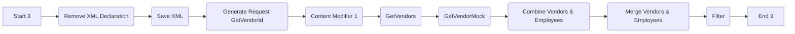
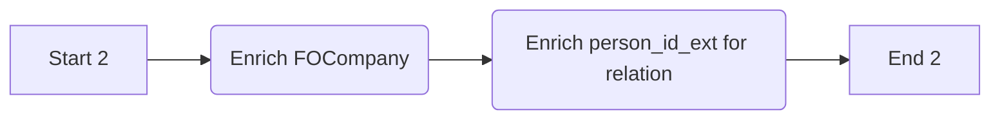
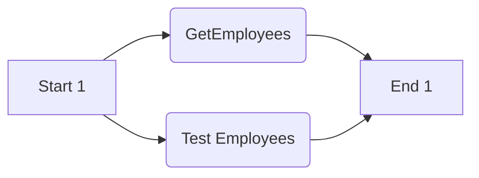

# Integration Flow Technical Specification

This document provides a detailed technical specification for the integration flow, outlining each process and step involved. It is designed to help new team members understand the logic and flow of the integration.

## Process Overview

The integration flow consists of several interconnected processes:

1.  **XML to CSV:** Converts XML data to CSV format.
2.  **Start from ProcessDirect:** Initiates the main process using a ProcessDirect adapter.
3.  **Scheduler:** Initiates the main process using a timer-based schedule.
4.  **Get Vendors from SAP ERP:** Retrieves vendor data from SAP ERP.
5.  **Main Process:** The central process that orchestrates the data transformation and transfer.
6.  **Enrich from SFSF:** Enriches employee data using SuccessFactors.
7.  **Get Employees from SFSF:** Retrieves employee data from SuccessFactors.

## Integration Flow Initiation

The integration flow can be initiated in two ways:

1.  **ProcessDirect Adapter:**
    *   The `Start from ProcessDirect` process is triggered by a `ProcessDirect` sender adapter. This allows for direct calls to the integration flow.
    *   The adapter is configured with the following details:
        *   **Component Type:** ProcessDirect
        *   **Entity Set:** (empty)
        *   **Authentication:** (empty)

2.  **Timer-Based Schedule:**
    *   The `Scheduler` process is triggered by a timer-based start event. This allows the integration flow to run automatically at predefined intervals.

## Detailed Process Description

### 1. Process: XML to CSV

This process converts XML data to CSV format.

*   **Start 4:** This is the starting point of the `XML to CSV` process.
*   **Set empty body:** This step initializes the message body, preparing it for further processing.
*   **XML to CSV Employee:** This step transforms employee-related XML data to CSV format.
*  **XML to CSV Delegate:** This step transforms delegate-related XML data to CSV format.
*  **XML to CSV Header:** This step transforms header-related XML data to CSV format.
*   **Gather 1:** This step collects all the transformed CSV data.
*   **End 4:** This is the end point of the `XML to CSV` process.

### 2. Process: Start from ProcessDirect

This process initiates the main flow using a ProcessDirect adapter and configures the necessary headers.

*   **Start 5:** This is the starting point of the `Start from ProcessDirect` process. It's triggered by a `ProcessDirect` sender adapter.
*   **Config Flow from Headers:** This step uses a `ContentModifier` to create several message headers. The following properties are set:

    | Property Name          | Action | Type   | Value                  | Default | Data type |
    |------------------------|--------|--------|------------------------|---------|-----------|
    | Concur\_SFTP\_Directory | Create | header |                        |         |           |
    | SkipDelegates         | Create | header |                        |         |           |
    | CashAdvanceAccountCode | Create | header |                        |         |           |
    | TestUsersSFSF           | Create | header |                        |         |           |
    | CompanyListSFSF        | Create | header |                        |         |           |
    | InactiveDaysSF        | Create | header |                        |         |           |
    | skipEncryption        | Create | header |                        |         |           |
    | local\_log             | Create | header |                        |         |           |
     | LogicalSystem          | Create | header |                        |         |           |

*   **Main Process:** This step calls the `Main Process` local process.
*   **End:** This is the end point of the `Start from ProcessDirect` process.

### 3. Process: Scheduler

This process initiates the main flow using a timer event and configures the necessary properties.

*   **Start Timer 1:** This is the starting point of the `Scheduler` process. It's triggered by a timer-based event.
*   **Config Flow:** This step uses a `ContentModifier` to create several message properties. The following properties are set:

    | Property Name          | Action   | Type      | Value                  | Default | Data type |
    |------------------------|----------|-----------|------------------------|---------|-----------|
    | Concur\_SFTP\_Directory | Create  | constant  | {{Concur_SFTP_Directory}} |         |           |
    | SkipDelegates         | Create  | constant  | {{SkipDelegates}} |         |           |
    | CashAdvanceAccountCode | Create  | constant  | {{CashAdvanceAccountCode}}  |         |           |
    | TestUsersSFSF           | Create   | expression | {{TestUsersSFSF}}            |         |           |
    | CompanyListSFSF        | Create   | constant  | {{CompanyListSFSF}}          |         |           |
    | InactiveDaysSF        | Create  | constant | {{InactiveDaysSF}}         |         |           |
    | skipEncryption        | Create   | constant  | {{skip_encryption}}           |         |           |
    | local\_log             | Create  | constant  | {{enable_log}}          |         |           |
    | LogicalSystem          | Create   | constant  | {{LogicalSystem}}           |         |           |

*   **Main Process:** This step calls the `Main Process` local process.
*   **End 5:** This is the end point of the `Scheduler` process.

### 4. Process: Get Vendors from SAP ERP

This process retrieves vendor data from SAP ERP.

*   **Start 3:** This is the starting point of the `Get Vendors from SAP ERP` process.
*   **Remove XML Declaration:** This step removes the XML declaration from the message payload using an XSLT Mapping.
*   **Save XML:** This step uses a ContentModifier to save the XML message in the `employeeXML` property. The following property is set:

    | Property Name  | Action | Type       | Value       | Default | Data type |
    |----------------|--------|------------|-------------|---------|-----------|
    | employeeXML    | Create | expression | ${in.body} |         |           |

*   **Generate Request GetVendorId:** This step transforms the incoming XML into a request format for the SAP ERP API call using the `GenerateGetVendorRequest` XSLT script.
*  **Content Modifier 1:** This step doesn't perform any transformation.
*   **GetVendors:** This step makes a call to the SAP ERP system to retrieve vendor data using the SOAP adapter. The receiver is `SAP_ERP` with credentials defined by `{{ECC_CRED}}`.
*   **GetVendorMock:** This step makes a call to a Mock system for testing purposes using the SOAP adapter.
*   **Combine Vendors & Employees:** This step combines the vendor and employee data.
*    **Merge Vendors & Employees:** This step merges the vendor and employee data using the `MergeEmployeeVendor` XSLT script.
*   **Filter:** This step filters the combined data.
*   **End 3:** This is the end point of the `Get Vendors from SAP ERP` process.

### 5. Process: Main Process

This is the central process that orchestrates the data transformation and transfer.

```mermaid
graph LR
    A[Start 6] --> B(Get Employees from SFSF);
    B --> C(Remove nodes without Person);
    C --> D(Filter current nodes);
    D --> E(Keep newest employment);
    E --> F(Remove employees with company code C628 and country code not Norway);
    F --> G(Remove incomplete Employees);
    G --> H(Remove unpaid leave employees);
    H --> I(Enrich from SFSF);
    I --> J(Get Vendors from SAP ERP);
    J --> K(Set Highest Direct Reports);
    K --> L(Employee SF to Concur);
    L --> M(XML to CSV);
    M --> N(AddBOM);
    N --> O(Router 1);
     O -- Route 1 --> P(PGPEncryptor 1);
     O -- Route 2 --> Q(Skip encryption for testing);
    P --> R(Log Msg);
    Q --> R
    R --> S(Concur SFTP);
    S --> T[End 6];
```

*   **Start 6:** This is the starting point of the `Main Process`.
*   **Get Employees from SFSF:** This step calls the `Get Employees from SFSF` local process.
*   **Remove nodes without Person:** This step removes nodes without person data using the `XSLT_FilterNodesWithoutPerson` XSLT script.
*   **Filter current nodes:** This step is a filter that doesn't change the data.
*   **Keep newest employment:** This step uses an XSLT script `KeepNewestEmployment` to retain only the newest employment data.
*   **Remove employees with company code C628 and country code not Norway:** This step removes employees with company code `C628` and country codes not equal to `Norway` using the `RemoveCompCodeC628AndCtryCodeNotNorway` XSLT script.
*   **Remove incomplete Employees:** This step removes incomplete employees using the `RemoveIncompleteEmployees` XSLT script.
*   **Remove unpaid leave employees:** This step removes employees on unpaid leave using the `RemoveUnpaidLeaveEmployees` XSLT script.
*   **Enrich from SFSF:** This step calls the `Enrich from SFSF` local process.
*  **Get Vendors from SAP ERP:** This step calls the `Get Vendors from SAP ERP` local process.
*  **Set Highest Direct Reports:** This step sets the highest direct reports using the `SetHighestDirectReports` XSLT script.
*   **Employee SF to Concur:** This step does not modify the content.
*  **XML to CSV:** This step calls the `XML to CSV` local process.
*   **AddBOM:** This step adds the Byte Order Mark.
*   **Router 1:** This step uses a router to determine the next step. It checks the value of the `skipEncryption` property:
    * If `skipEncryption` is `true`, it routes to the `Skip encryption for testing` step.
    * Otherwise it routes to the `PGPEncryptor 1` step.
*   **PGPEncryptor 1:** This step encrypts the data using PGP encryption.
*  **Skip encryption for testing:** This step does not perform any transformation.
*  **Log Msg:** This step is used to log the message.
*  **Concur SFTP:** This step sends the transformed data to the Concur SFTP server using the SFTP adapter. The receiver is `Concur_SFTP`.
*   **End 6:** This is the end point of the `Main Process`.

### 6. Process: Enrich from SFSF

This process enriches the data with information from SuccessFactors.

*   **Start 2:** This is the starting point of the `Enrich from SFSF` process.
*   **Enrich FOCompany:** This step enriches the data with `FOCompany` information using an API enrichment call to SuccessFactors. The resource path is `FOCompany`, the alias is `{{SF_CRED}}`, the message protocol is `OData V2`, and the address is `{{SF_URL}}`.
*   **Enrich person\_id\_ext for relation:** This step enriches the data with `person_id_ext` for relations using an API enrichment call to SuccessFactors. The resource path is `EmpEmployment`, the alias is `{{SF_CRED}}`, the message protocol is `OData V2`, and the address is `{{SF_URL}}`.
*   **End 2:** This is the end point of the `Enrich from SFSF` process.

### 7. Process: Get Employees from SFSF

This process retrieves employee data from SuccessFactors.

*   **Start 1:** This is the starting point of the `Get Employees from SFSF` process.
*   **GetEmployees:** This step makes a call to the SuccessFactors system to retrieve employee data using the SuccessFactors adapter. The receiver is `SFSF_SOAP`.
*   **Test Employees:** This step makes a call to a test system for testing purposes using the SuccessFactors adapter.
*   **End 1:** This is the end point of the `Get Employees from SFSF` process.

This detailed specification should provide a comprehensive understanding of the integration flow's logic and steps. If you have any further questions, please ask.
